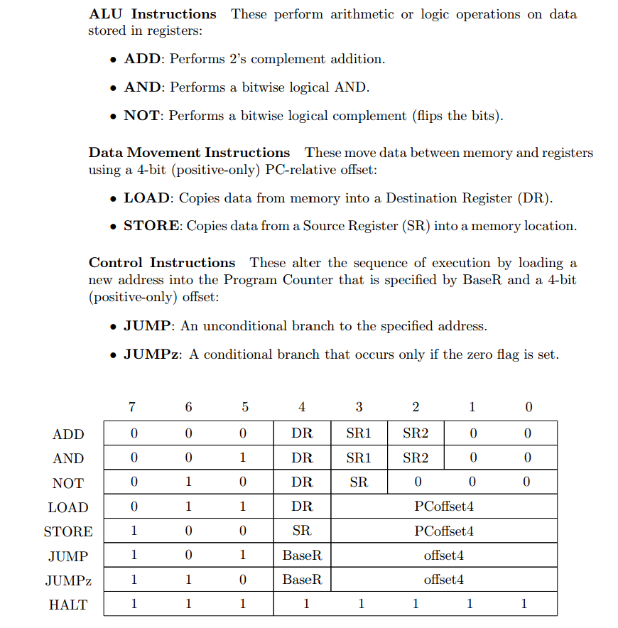
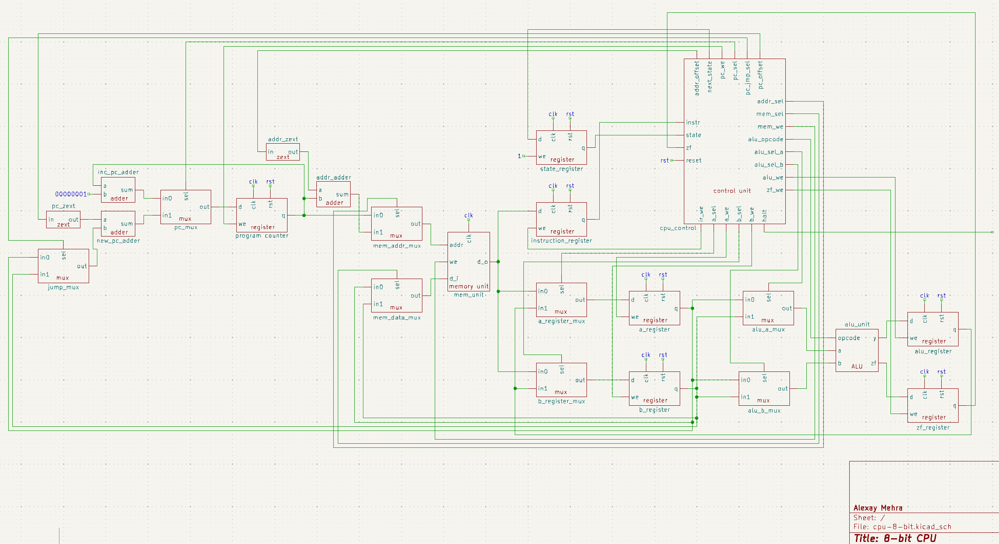

# 8-bit CPU
Complete 8-bit CPU with simple ISA. Von Neumann Architecture.

## Toolchain:
- **Editor:** Visual Studio Code
- **Simulation:** Icarus Verilog 12.0
- **Platform:** Windows Subsystem for Linux 2 (WSL2)

## Instruction Set Architecture

   
  
   

*Click the image above to open the full PDF specification.*

## Schematic

   
  
   

*Click the image above to open the schematic in full size.*

## Todo
- Add usage guide and polish README
